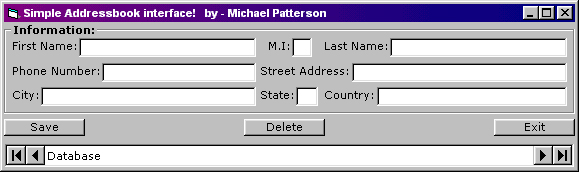



## Address Book interface\!

### Description

Well, I was trying to make a address book and I couldent think on an interface. So I thought for like 1 hour and I made one and I decided for thoes people out their that want to make an address book, that they could you my interface! If you use this please give me credit and you can re-arranfge it, and do aything to it!
 
### More Info
 
nadda

I dunno

             |
---                |---
**Submitted On**   |2000-03-16 15:44:06
**By**             |[michael patterson](https://github.com/Planet-Source-Code/PSCIndex/blob/master/ByAuthor/michael-patterson.md)
**Level**          |Beginner
**User Rating**    |3.6 (18 globes from 5 users)
**Compatibility**  |VB 5\.0, VB 6\.0
**Category**       |[Databases/ Data Access/ DAO/ ADO](https://github.com/Planet-Source-Code/PSCIndex/blob/master/ByCategory/databases-data-access-dao-ado__1-6.md)
**World**          |[Visual Basic](https://github.com/Planet-Source-Code/PSCIndex/blob/master/ByWorld/visual-basic.md)
**Archive File**   |[CODE\_UPLOAD40243162000\.zip](https://github.com/Planet-Source-Code/michael-patterson-address-book-interface__1-6637/archive/master.zip)

